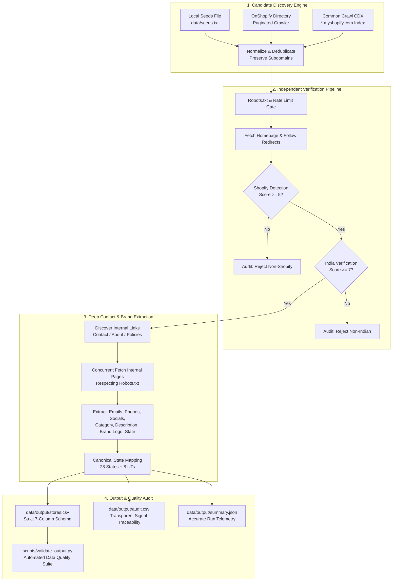

# Discover Indian Shopify Stores

An enterprise-grade, asynchronous Python discovery and verification pipeline that identifies, verifies, crawls, and extracts high-fidelity brand and contact intelligence for **1,000+ authentic Indian Shopify storefronts**.

Built for the **Rivyou SDE Intern Technical Assignment**.

---

## Architecture Overview

The system operates on an evidence-first, multi-stage pipeline designed for **correctness, data quality, and responsible crawling**:



---

## Key Principles & Guarantees

1. **Correctness > Completeness > Raw Count**: An independently verified store with traceable evidence is infinitely more valuable than an unverified list of scraped domains.
2. **Zero Fabricated Data**: If an email, phone number, state, or logo is absent on public pages, it remains blank. No dummy values or placeholder generation.
3. **No Silent Failures**: All discovery mechanisms, network retries, and parse errors emit structured diagnostic logs with explicit counts and HTTP statuses.
4. **Polite Web Crawling**: Strict concurrency control via `asyncio.Semaphore`, domain-level rate throttling, full robots.txt compliance, and persistent retry backoffs.

---

## Data Sources

The pipeline implements multiple candidate discovery channels:

1. **Source A: OnShopify India Directory (`https://onshopify.com/country-websites/IN/`)**:
   - Crawls paginated directory pages (`/country-websites/IN/`, `/country-websites/IN/2`, etc.) with configurable depth (`MAX_DISCOVERY_PAGES`).
   - Concurrently fetches store detail cards (`/website/shopify-site-XXXX`) to extract live storefront domains.
   - Detects over 5,000+ candidate domains across 240+ directory pages.
2. **Source B: Common Crawl CDX Index (`https://index.commoncrawl.org/`)**:
   - Queries public Common Crawl CDX APIs for `*.myshopify.com` domains.
   - If the remote Common Crawl server closes connection or is unreachable, the pipeline logs detailed diagnostics (`[discovery:common-crawl] collection=... error=...`) and continues gracefully without blocking execution.
3. **Source C: Local Seed Support (`data/seeds.txt`)**:
   - Supports user-curated domains (e.g. `brand.com`, `https://brand.in`, `brand.myshopify.com`).
   - Ignores blank lines and `#` comments.
   - **Crucial Rule**: Every seed undergoes the exact same independent verification pipeline as external candidates.

---

## Candidate Normalization & Deduplication

- Strips protocol (`http://`, `https://`), userinfo, port numbers, paths, query arguments, and URL fragments.
- Strips leading `www.` and trailing slashes.
- **Preserves Subdomains**: Does **not** collapse `brand1.myshopify.com` and `brand2.myshopify.com` into `myshopify.com`. Each Shopify subdomain represents an isolated store.
- **Follows Redirects**: When stores redirect (e.g. `sugar-cosmetics.myshopify.com` $\to$ `sugarcosmetics.com`), the final canonical destination domain is recorded and deduplicated.

---

## Shopify Detection & Scoring

To prevent false positives (such as blog posts containing *"We migrated from Shopify"*), detection requires concrete technical storefront signals:

| Signal | Description | Weight |
|---|---|:---:|
| `*.myshopify.com` | Subdomain on myshopify.com infrastructure | +10 |
| `window.Shopify` | Core Shopify client-side runtime object | +5 |
| `Shopify.shop` / `Shopify.theme` | Storefront metadata declaration in JavaScript | +5 |
| `cdn.shopify.com` | Primary Shopify content delivery network assets | +5 |
| `/cdn/shop/` | Modern Shopify asset path format | +5 |
| `shopify_core_js` | Scripts like `shopify_common.js`, `Shopify.loadFeatures` | +4 |
| `shopify-section` | Shopify Liquid theme section markup wrapper | +2 |
| `shopify-payment-button` | Native dynamic checkout and accelerated buttons | +2 |
| `shopify_meta_attribute` | Meta tags such as `shopify-checkout-api-token` | +2 |
| HTTP Headers / Cookies | `x-shopid`, `_shopify_y`, `_shopify_s` | +2 |
| DNS CNAME | CNAME record pointing to `shops.myshopify.com` | +2 |

- **Default Threshold**: `SHOPIFY_THRESHOLD = 5`.
- A generic blog mention scores **0** and is immediately rejected.

---

## India Verification & State Extraction

A business is **not** assumed to be Indian solely based on a `.in` domain or a currency symbol (`₹`). The verification engine scores multi-layered commercial, geographic, and tax evidence:

| Signal | Description | Weight |
|---|---|:---:|
| JSON-LD Indian Address | `PostalAddress` schema with `addressCountry: "IN"` / `"India"` | +8 |
| Canonical Indian State | Verified state name or standard abbreviation (`MH`, `KA`, `DL`) | +6 |
| GSTIN Match | 15-character Indian Goods & Services Tax Number | +6 |
| `+91` Phone Number | E.164 phone number with Indian country code | +5 |
| Indian PIN Code | 6-digit postal code (`[1-8][0-9]{5}`) in address context | +5 |
| Major Indian City | City identified in business contact context (e.g. Bengaluru, Mumbai) | +4 |
| Indian Payment Gateway | Integration with Razorpay, Cashfree, PayU, Paytm, PhonePe, UPI | +3 |
| INR / ₹ Currency | Store currency indicated as INR or ₹ | +2 |
| `.co.in` Domain | Commercial Indian second-level domain | +2 |
| `.in` Domain | Country-code top-level domain | +1 |

- **Default Threshold**: `INDIA_THRESHOLD = 7`.
- **False Positive Prevention**: A drop-shipping store with only `.in` (1 pt) and `₹` (2 pts) scores **3**, safely failing the threshold of **7**. Real proof of business presence is required.

### Canonical Indian State Dictionary
- Supports all **28 States** and **8 Union Territories** (36 entities).
- Normalizes standard abbreviations (`KA` $\to$ Karnataka, `MH` $\to$ Maharashtra, `TN` $\to$ Tamil Nadu, `DL` $\to$ Delhi, `GJ` $\to$ Gujarat, etc.).
- Derives state from the first two digits of detected GSTIN numbers (e.g., `27` $\to$ Maharashtra, `29` $\to$ Karnataka, `07` $\to$ Delhi).

---

## Data Extraction

1. **Contact Page Discovery**:
   - Inspects homepage for internal links containing `contact`, `contact-us`, `about`, `about-us`, `policies`.
   - Concurrently fetches top candidate pages (max 2 per domain to respect server resources).
2. **Email Extraction**:
   - Discovers emails from `mailto:` links, visible text regex, and JSON-LD markup.
   - Cleans out image file extensions (`.png`, `.jpg`, `.webp`, `.svg`, `.css`, `.js`), npm version tags (`bootstrap-icons@1.13.1`), and placeholder dummy emails (`example@example.com`).
   - Normalizes to lowercase and deduplicates.
3. **Phone Extraction**:
   - Parses visible text and `tel:` links using Google's `phonenumbers` package configured with default region `'IN'`.
   - Formats numbers in standard **E.164** format (`+919876543210`).
4. **Social Media Extraction**:
   - Discovers official brand profiles for: Instagram, Facebook, Twitter / X, LinkedIn, YouTube, Pinterest.
   - Strips tracking query parameters (`?utm_*`, `?fbclid=`, `?ref=`).
   - Rejects share dialogs (e.g. `facebook.com/sharer/sharer.php`, `twitter.com/intent/tweet`).
   - Rejects root platform homepages (`https://instagram.com/`).
5. **Store Category**:
   - Categorizes stores into curated e-commerce segments (`apparel & fashion`, `beauty & skincare`, `jewelry`, `home decor`, `food & beverages`, `electronics`, `sports & fitness`, `baby & kids`, `health & wellness`, `footwear`, `accessories`, `furniture`, `books & stationery`, `pets`, `other`).
   - Uses weighted keyword scoring across page title, meta description, navigation menu, and collection links.
6. **Tagline / Description**:
   - Extracts the brand's original wording in order of priority: (1) `meta[name="description"]`, (2) `meta[property="og:description"]`, (3) JSON-LD `description`, (4) first H1 hero heading.
   - Cleans whitespace and truncates safely to $\le$ 500 characters. Never fabricates AI summaries.
7. **Brand Logo Extraction**:
   - Prioritizes JSON-LD `Organization.logo` and DOM `` elements with `logo`, `brand-logo`, or `header__heading-logo`.
   - **Strictly rejects favicons** (`favicon.ico`, `favicon.png`, `apple-touch-icon`, avatars, payment badges).

---

## Output Schemas

### 1. `data/output/stores.csv` (Main Deliverable)
Contains exactly the 7 required columns:
| Column | Description | Example |
|---|---|---|
| `domain_url` | Canonical HTTPS URL of verified store | `https://powerlook.in` |
| `all_contacts` | Semicolon-separated verified emails and E.164 phones | `support@powerlook.in;+919696333000` |
| `socials` | Semicolon-separated normalized official social profiles | `https://instagram.com/powerlookofficial` |
| `category` | Inferred storefront category | `apparel & fashion` |
| `tagline_description` | Original brand description ($\le 500$ chars) | `Shop the latest men's fashion online...` |
| `logo` | Direct URL to brand logo image | `https://www.powerlook.in/cdn/shop/files/pl-logo.png` |
| `state` | Canonical Indian State or Union Territory | `Maharashtra` |

### 2. `data/output/audit.csv` (Traceability & Reasoning)
Records every candidate domain evaluated, including:
`domain_url, final_url, http_status, shopify_verified, shopify_score, shopify_signals, india_verified, india_score, india_signals, state_source, contact_pages_checked, emails_found, phones_found, socials_found, logo_source, category_source, description_source, robots_allowed, errors`

### 3. `data/output/summary.json` (Run Telemetry)
```json
{
  "candidate_count": 116,
  "unique_candidate_count": 116,
  "shopify_verified": 25,
  "india_verified": 25,
  "final_stores": 25,
  "duplicates_removed": 0,
  "email_coverage": 0.84,
  "phone_coverage": 0.84,
  "social_coverage": 0.96,
  "state_coverage": 0.96,
  "logo_coverage": 1.0,
  "elapsed_seconds": 128.4
}
```

---

## Project Structure

```
rivyou-shopify-discovery/
├── README.md                  # Comprehensive architectural documentation
├── requirements.txt           # Production dependencies
├── pyproject.toml             # Project metadata and test configuration
├── .gitignore                 # Git ignore patterns
├── .env.example               # Environment variables template
├── LICENSE                    # MIT License
├── run.py                     # CLI entrypoint for discovery & verification
├── data/
│   ├── seeds.txt              # Local seed domains
│   ├── raw/                   # Temporary raw caches
│   ├── processed/             # Checkpoints
│   └── output/
│       ├── stores.csv         # Verified store output
│       ├── audit.csv          # Decision audit log
│       └── summary.json       # Execution metrics
├── src/
│   ├── __init__.py            # Package root
│   ├── config.py              # Configuration dataclass and environment settings
│   ├── models.py              # Data transfer objects
│   ├── utils.py               # Domain normalization, sanitization, social cleaning
│   ├── robots.py              # Robots.txt parser and caching
│   ├── fetch.py               # Resilient async HTTP client with retries and throttling
│   ├── discovery.py           # Multi-source candidate discovery engine
│   ├── shopify.py             # Shopify multi-signal scoring engine
│   ├── india.py               # India verification and canonical state engine
│   ├── extract.py             # Deep contact, brand, and metadata extractor
│   └── pipeline.py            # End-to-end pipeline orchestrator
├── scripts/
│   └── validate_output.py     # Independent quality audit script
├── tests/
│   ├── conftest.py            # Pytest environment fixtures
│   ├── test_shopify.py        # Shopify signal and false positive tests
│   ├── test_india.py          # India verification, GSTIN, and state tests
│   ├── test_extract.py        # Email, phone, social, and logo extraction tests
│   └── test_utils.py          # Normalization and validation tests
└── .github/
    └── workflows/
        └── tests.yml          # GitHub Actions CI workflow
```

---

## Installation & Setup

### Prerequisites
- Python 3.11+
- Virtual environment (recommended)

```bash
# Clone the repository
git clone https://github.com/<your-username>/rivyou-shopify-discovery.git
cd rivyou-shopify-discovery

# Create and activate virtual environment
python -m venv venv
# On Windows:
venv\Scripts\activate
# On Linux/macOS:
source venv/bin/activate

# Install dependencies
pip install -r requirements.txt
```

---

## Running the Pipeline

### 1. Development Test Run (5 or 20 stores)
```bash
python run.py --target 20
```

### 2. Full Production Run (1,000+ stores)
```bash
python run.py --target 1000 --max-concurrency 10
```

### 3. CLI Options
```bash
python run.py --help

Options:
  --target INTEGER             Target number of verified stores (default: 1000)
  --max-concurrency INTEGER    Max concurrent async requests (default: 10)
  --source [all|onshopify|commoncrawl|seeds]
                               Discovery source to use (default: all)
  --input PATH                 Path to seeds file (default: data/seeds.txt)
  --max-pages INTEGER          Max directory pagination depth (default: 100)
  --shopify-threshold INTEGER  Shopify score threshold (default: 5)
  --india-threshold INTEGER    India score threshold (default: 7)
  --log-level [DEBUG|INFO|WARNING|ERROR]
                               Log verbosity (default: INFO)
```

### 4. Running Validation
Verify schema integrity, domain validity, canonical states, and coverage metrics:
```bash
python scripts/validate_output.py
```

### 5. Running Unit Tests
```bash
pytest -v -q
```

---

## Important Assumptions

1. **Assumption 1**: A `.in` domain does **not** automatically prove that a business is Indian. International entities can register `.in` domains.
2. **Assumption 2**: A `.com` domain does **not** automatically mean non-Indian. Major Indian D2C brands (e.g. `bluorng.com`, `bombayshirts.com`, `sugarcosmetics.com`, `fablestreet.com`) operate on `.com`.
3. **Assumption 3**: A `myshopify.com` subdomain confirms Shopify hosting but does **not** automatically prove Indian business presence.
4. **Assumption 4**: An Indian State / UT is only populated when there is reasonable geographic evidence (GSTIN, postal code, city, JSON-LD address, or explicit state text).
5. **Assumption 5**: Missing public information remains blank rather than being fabricated or guessed.
6. **Assumption 6**: Store category is inferred from visible storefront content, product names, navigation menus, and meta descriptions.
7. **Assumption 7**: A brand logo is preferred over a favicon; favicons and generic payment/cart icons are explicitly rejected.

---

## Ethical & Responsible Crawling

- **Robots.txt**: Checked and cached before fetching store pages. If robots.txt disallows crawling on `/` or contact paths, the store is skipped or restricted, and the denial is recorded in `audit.csv`.
- **Concurrency & Throttling**: Limited to 10 concurrent requests globally, with enforced delays between consecutive requests to the same domain.
- **Fail-Fast & Timeout**: Configured with a 15-second timeout and 2 retries with exponential backoff on temporary 5xx errors to prevent hammering struggling servers.

---

## License

This project is licensed under the MIT License - see the [LICENSE](LICENSE) file for details.
